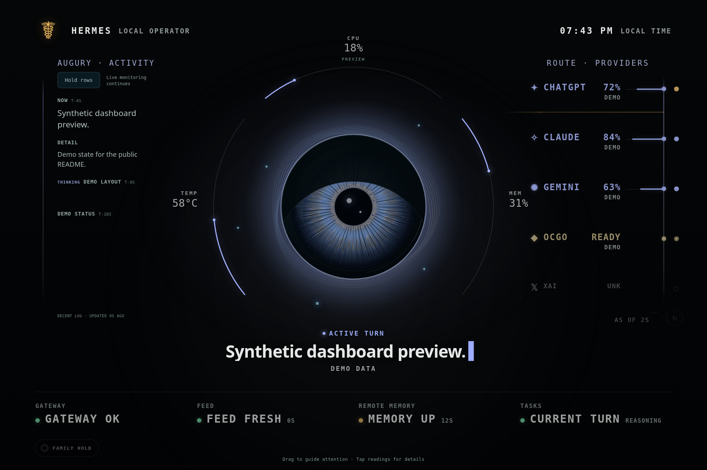

# Hermes personal display

A local, browser-based companion display for [Hermes Agent](https://github.com/NousResearch/hermes-agent). It turns a small screen attached to a home-lab machine into an ambient status panel for an AI operator: current activity, tool use, health, degraded states, touch cues, and a lightweight character runtime.



This repo is useful if you are running Hermes Agent on a local box and want something more physical than a chat window: a kiosk display that shows what the agent is doing without leaking prompts, answers, secrets, or raw logs.

## Why this exists

Hermes can run as a practical local operator: reading files, using tools, monitoring services, and coordinating work. That creates a UX problem. If the assistant is doing real work, the human should be able to see enough state to trust it without staring at terminal logs.

Hermes personal display is one answer:

- A local kiosk UI for a small HDMI/USB-C display.
- A character-style runtime that reacts to assistant state.
- Display-safe status packets instead of raw conversation transcripts.
- Local-only service templates for preview and kiosk operation.
- Tests and fixtures for state normalization, event validation, and privacy boundaries.

## What it shows

The display is intentionally not a second chat client. It is an ambient instrument panel.

Current capabilities include:

- Assistant state: idle, active, waiting, finalizing, complete, blocked, degraded.
- Tool activity hints: shell, Python, file reads, search, patch/write, browser, web, planning.
- Provider/model route rail for quick visibility into active backend routing.
- Health rails for display feed freshness, local service state, and degraded conditions.
- A character runtime with gaze, blink, mouth, status badges, touch effects, and motion states.
- Local touch/entertainment hooks for physical-display experiments.
- A loopback-first avatar event bus contract for safe lifecycle events.

## Why Hermes Agent users may care

If you are using Hermes as a persistent local agent, this repo gives you patterns for:

- Turning agent activity into display-safe state.
- Separating UX signals from private conversation content.
- Running a kiosk UI from a local systemd user service.
- Building trust cues around tool use and degraded states.
- Testing that fixtures, state packets, and event streams do not carry secrets.
- Designing a physical presence for a home-lab or office AI assistant.

The most reusable pieces are not the mascot art. They are the boundaries: loopback by default, allowlisted display intents, bounded event payloads, deterministic rendering, and tests that reject credential-shaped strings.

## Architecture

```text
Hermes Agent runtime / local monitors
        |
        | display-safe state, lifecycle hints, health signals
        v
schemas/*.json display contract
        |
        | generated JS/Python constants
        v
scripts/hermes_display_server.py
        |
        | /api/hermes-state and optional avatar event stream
        v
Browser kiosk runtime
        |
        | deterministic reducer + SVG/DOM renderer
        v
Small physical display
```

Core paths:

- `src/character-runtime.html` - current kiosk/runtime page.
- `src/mascot/` - character runtime, behavior machine, touch effects, audio hooks, sanitization.
- `schemas/` - public display-state/avatar-event/optic-state contract sources plus shared presets/postures.
- `src/generated/display-contract.js` - generated browser contract constants.
- `scripts/generated/display_contract.py` - generated Python contract constants.
- `src/state.js` - display packet handling that consumes the generated contract.
- `scripts/hermes_display_server.py` - compatibility HTTP route boundary for the local static server plus display-state API.
- `scripts/display_state/` - focused module boundary for collector, resolver, contract, privacy, persistence, route rail, remote memory, entertainment, and fixtures.
- `scripts/avatar_event_bus.py` - avatar event validation and SSE helpers.
- `tests/fixtures/` - synthetic display-safe preview and regression fixtures; see `tests/fixtures/README.md`.
- `deploy/systemd-user/` - preview/kiosk user service templates; see `docs/systemd-user-units.md`.
- `docs/display-contract.md` - schema-to-generated-bindings contract notes.
- `docs/project-manifest.md` - current source map and cleanup boundary.

## Privacy model

The display should show what the agent is doing, not what the human said.

Design rules used in this repo:

- Bind local services to loopback by default.
- Treat browser-facing state as display-safe data, not raw logs.
- Use allowlisted lifecycle events and compact labels.
- Reject credential-shaped strings in event fixtures and validators.
- Keep environment-specific values in local env files, not Git.
- Keep raw screenshots, review dumps, transcripts, and bulky asset packs out of the repo.

This is still an experimental local-display project. Review the code and defaults before exposing anything beyond localhost.

### Display contract boundary

The product boundary is the generated display contract, not the current mascot implementation:

```text
Hermes Agent or local monitor
  -> emits display-safe state/event packets
  -> schemas/ contract validates packet shape and privacy boundary
  -> kiosk renders without knowing raw prompts, raw logs, tool output, file paths, or secrets
```

Authoritative sources are documented in `docs/display-contract.md` and live under `schemas/`:

- `schemas/hermes-display-state.schema.json`
- `schemas/hermes-avatar-event.schema.json`
- `schemas/hermes-optic-state.schema.json`
- `schemas/hermes-display-presets.json`
- `schemas/hermes-optic-postures.json`

After changing those files, regenerate both runtimes:

```bash
python3 scripts/generate_display_contract.py
```

Do not hand-edit `src/generated/display-contract.js` or `scripts/generated/display_contract.py`.

### Display operating modes

Safe Display Mode is the default. It may show health, lifecycle, coarse work state, labels, and bounded motion. It must not show prompts, raw logs, answers, secrets, file paths, URLs, tool I/O, transcripts, traceback dumps, CUI/customer/government terms, or credential-like strings.

Private Diagnostic Mode is explicit opt-in. It may show redacted local diagnostics for troubleshooting. It is never enabled by default and should remain local/private.

Family/Entertainment Mode is explicit opt-in. It uses local/browser TTS fallback or bounded server-side generation. It does not receive work data or personal data. Entertainment request validation blocks prompt/log/message/system/developer/context/tool-output fields, file paths, URLs, credential-like strings, CUI/customer/government terms, and traceback-like content.

## Quick start

Requirements:

- Node.js 20+
- npm
- Python 3.11+
- Chromium or Chrome for kiosk mode

Install dependencies:

```bash
npm ci
```

Run the Vite dev server:

```bash
npm run dev
```

Open:

```text
http://127.0.0.1:8770/src/character-runtime.html
```

For kiosk mode in local development:

```text
http://127.0.0.1:8770/src/character-runtime.html?kiosk=1&orientation=landscape
```

Physical kiosk source of truth:

```text
Canonical operator runtime:
  /src/character-runtime.html?kiosk=1&orientation=landscape&augury=1

Canonical family runtime:
  /src/character-runtime.html?kiosk=1&orientation=landscape&audience=family&touch=fun

Canonical control:
  hermes-display status|verify|restart|fix|screenshot|build-id|url

Physical panel:
  DP-2, 1920x1280, inverted, primary, position 0x0
```

`hermes-display verify` checks the live Chromium command line for the full operator URL shape, including the build cache key (`v=<build>`). `audience=family` or `family=1` suppresses private/operator overlays such as Augury.

The Python display server is also available for local state API work:

```bash
python3 scripts/hermes_display_server.py --host 127.0.0.1 --port 8770
```

## Tests

Run the main test suite:

```bash
npm test
```

Additional checks:

```bash
npm run check:client-events
npm run check:kiosk
npm run check:augury-feed
npm run build
```

Fixture families and their consumers are documented in `tests/fixtures/README.md`.

Full local gate, including Playwright projects:

```bash
npm run test:all
```

## Reference hardware

This project does not require a specific display or mini PC. The public screenshot and reference deployment use commodity hardware:

- **Display:** [MINIX SF10T portable monitor](https://www.amazon.com/dp/B0G3PBK4LG), a 10.5-inch IPS touchscreen panel.
- **Native panel mode:** 1920 x 1280, 3:2 aspect ratio, 60 Hz.
- **Display connectivity:** USB-C with DP Alt Mode or Mini HDMI, with separate USB touch/power wiring depending on host support.
- **Reference host:** Intel NUC7i5BNH mini PC.
- **CPU/GPU:** Intel Core i5-7260U with Intel Iris Plus Graphics 640.
- **Software stack used here:** Linux, Xorg/Openbox, Chromium kiosk, Python display-state server, and systemd user services.

Those details are included so other Hermes Agent users can reproduce the physical setup with similar small-panel hardware. Treat them as a known-good reference, not a bill of materials.

## Kiosk deployment

The repo includes systemd user unit templates under `deploy/systemd-user/`. See `docs/systemd-user-units.md` for the service layout, install notes, and local environment boundaries.

Typical flow:

```bash
scripts/detect-display-env.sh
scripts/install-user-units.sh
systemctl --user daemon-reload
systemctl --user start hermes-personal-display-preview.service
systemctl --user start hermes-personal-display-kiosk.service
```

Keep machine-specific values in your local environment file. Start from:

```text
deploy/systemd-user/hermes-personal-display.env.example
```

Do not commit live display paths, session values, API keys, or machine-specific secrets.

## Display control CLI

The live NUC display is controlled through the service-aware CLI:

```bash
hermes-display status
hermes-display verify
hermes-display restart
hermes-display fix
hermes-display screenshot
hermes-display build-id
hermes-display url
```

`/home/brian/.local/bin/hermes-display` is a symlink to `scripts/hermes-display` in this repo. Keep that script in the source tree: `xsession-minix-kiosk.sh` derives the cache-busted kiosk URL from it, and `check:kiosk` verifies that restart/fix/status still target the real `hermes-personal-display-minix.service` path rather than an unmanaged Chromium process.

## Project status

This is a working personal-display runtime extracted from a private home-lab setup and scrubbed for public release. It is not a polished product or a generic Hermes plugin yet.

Good fit today:

- Hermes Agent users building a local physical dashboard.
- Home-lab operators experimenting with ambient agent presence.
- Developers looking for patterns around display-safe agent state.
- People interested in browser kiosk UIs for local AI systems.

Not a good fit yet:

- Hosted multi-user dashboards.
- Cloud-first telemetry.
- Remote monitoring over the public internet.
- A drop-in package with one-command Hermes integration.

## Roadmap ideas

Useful next steps for contributors:

- Document a minimal Hermes Agent integration path.
- Add a small sample state publisher that does not depend on a specific home setup.
- Split reusable event-bus/state contracts into a cleaner package boundary.
- Add screenshots or short clips for major display states.
- Add GitHub Actions for tests and secret scanning.
- Add a documented theme/character customization path.

## Keywords

Hermes Agent, local AI assistant, AI agent dashboard, personal display, ambient agent UI, home-lab AI, browser kiosk, SVG character runtime, local-first automation, systemd user service, display-safe telemetry, avatar event bus, AI operator UX.

## License

MIT for the project-authored code and documentation. See [`LICENSE`](LICENSE).

Third-party or prototype assets keep their original provenance and license notes under `src/**/SOURCE-LICENSE.md`. The retained prototype asset packs currently documented there are CC0, but check those files before reusing visual assets outside this repo.
