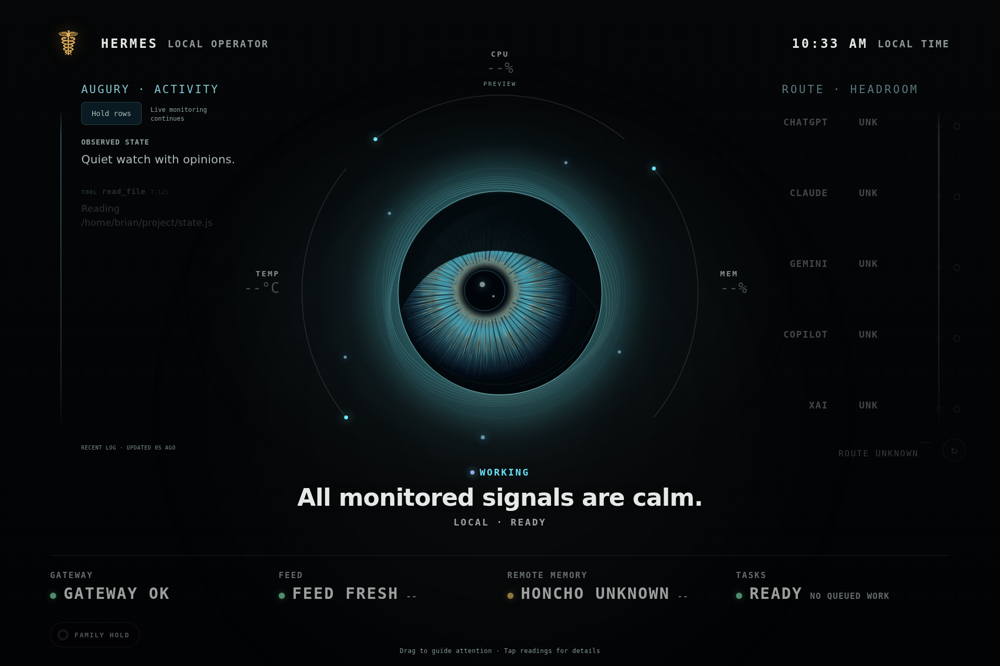
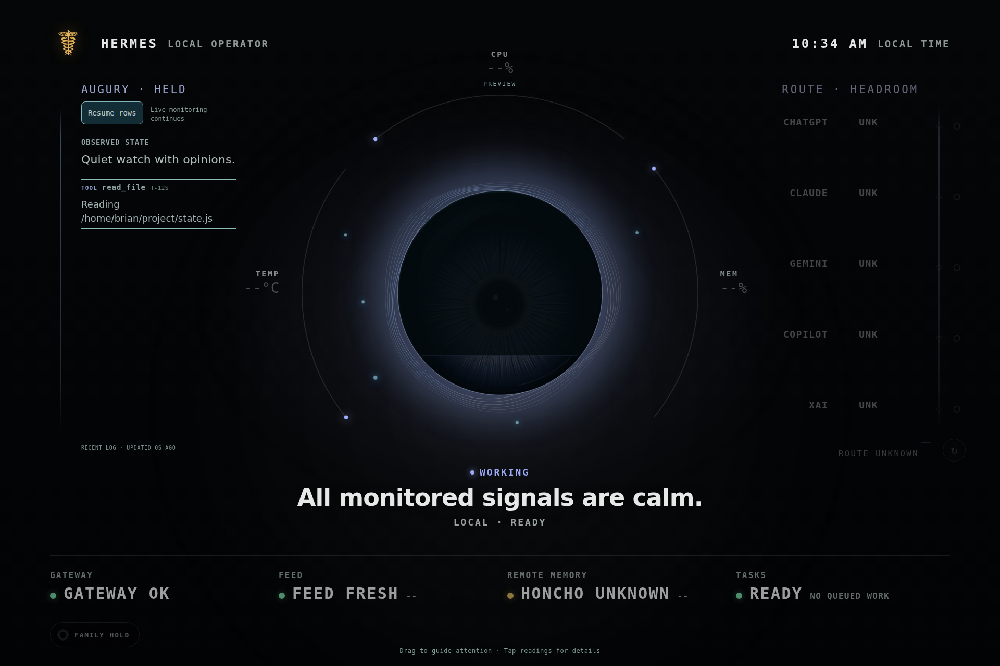

# Augury reading hold

Reviewed September 8, 2026. Display base: `0888aaed7869c66657e21f57f34bc3c2c60dd81d`.
This is a reviewable display change, not a deployment claim.

## Behavior

Tap **Hold rows** to keep the visible Augury observations still while reading several entries.
The heading changes to **AUGURY · HELD**, the button becomes **Resume rows**, and the
adjacent note explicitly says live monitoring continues. The control has a minimum
44-pixel height, visible keyboard focus and an `aria-pressed` state.

Only row rendering is held. Polling, feed-health labels, current dashboard state,
eye reactions and existing motion continue. **LOG DELAYED** remains visible if the
feed fails while rows are held. Row ages are snapshot ages, not advancing live ages.
Resuming renders the latest queued snapshot, not a replay of intermediate updates.
The hold is page-local and resets on reload; no Hermes operation is paused or sent.

The existing excerpt inspector remains independent. Opening and closing an excerpt
does not cancel a manual row hold. Resuming rows while an excerpt is open does not
unpin that excerpt; rows resume after both holds are released. At most one pending
row snapshot is retained. Family mode creates neither the control nor the private feed.

Normal paths and selected log text retain the existing credential-specific redaction
and text-safe rendering. This change does not alter compact-text preferences, the
smaller eye, blue motes, truthful non-pipeline activity, palette or motion budgets.

## Synthetic visual evidence

These screenshots are browser previews at 1920×1280, not host measurements. The
fixture path and observations are synthetic. Existing PREVIEW labeling is retained.

### Live rows

### Held rows

Visual inspection corrected the first draft's heading/button overlap. Geometry
assertions now require the full 44-pixel button between the heading and list.

## Verification

- `npm test`: 53 JavaScript tests, 151 Python tests, stack, generated contract,
  server smoke checks, Python compilation and build-ID checks passed.
- Production build, kiosk, Augury credential/content checks, client event checks
  and `git diff --check` passed.
- Four focused browser files passed 11 tests; seven small-viewport-inapplicable
  cases were skipped. This includes existing metric, drag, cancellation, private
  excerpt, family and session-control coverage at 1920×1280 and applicable 320×480.
- The final three new hold cases were then rerun and passed with actual browser
  touch emulation, keyboard activation, ongoing polling, nested hold release,
  delayed-feed detection, inert markup, family isolation and layout assertions.
- Chromium 149 was explicitly selected locally because downloading Playwright's
  matching Chromium 148 timed out. Matching-browser GitHub CI remains a separate gate.
- A temporary local test configuration used port 4181 to avoid another active
  worktree's preview. It is not part of the PR; checked-in tests use normal CI config.

## Integration and acceptance

R04 gains a useful touch action; R06/R07 gain deliberate reading control and a
clear held/live distinction. No new physical acceptance is claimed. Check touch
mapping, font legibility at normal distance, row density with five long observations,
and sustained operation on the actual MINIX/current host before accepting deployment.

The simultaneous process-handoff/receipt/inspection implementation in
`feat/handoff-aware-inspection` was deliberately left untouched. This branch does
not claim that gap fixed. Both branches may change generated build IDs and CSS in
separate sections: regenerate the build ID from the combined tree and rerun the
browser tests when integrating, rather than choosing one branch's hash by hand.

Upstream main was unchanged at `6e2b8e070d28b1a3381a3fb290b6b8d6cce13cef` during this
check; no new upstream API is required. Existing pending APIs remain excluded.
Rollback is a normal revert of this PR, followed by build-ID regeneration/build
through the existing deployment process. No merge or deployment is authorized here.
