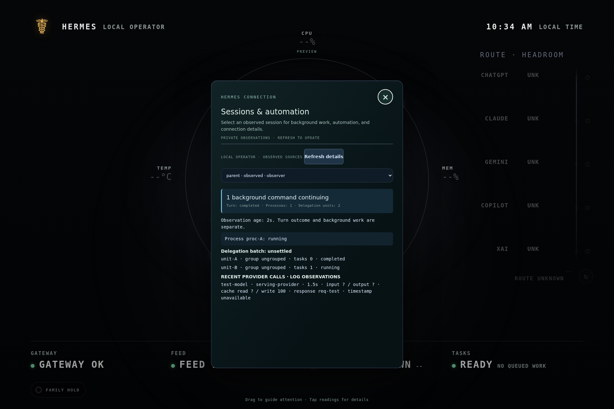
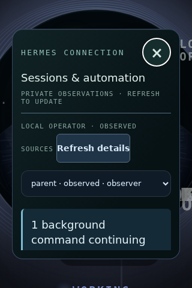

# Background work and stable touch inspection

This follow-up starts from display `main` at `0888aaed7869c66657e21f57f34bc3c2c60dd81d` and reviews Hermes `main` at `6e2b8e070d28b1a3381a3fb290b6b8d6cce13cef`. Neither commit identifies the deployed host.

## Problem and behavior

A terminal call can return a background process ID with notifications disabled. A subagent can then hand that process to its parent. Neither the tool return nor either conversation ending establishes process exit. Previously, the observer could miss both observations and announce that all work settled.

- Track structured terminal process IDs even with notifications off. Ignore the launch response's exit code when establishing the command's outcome.
- Recognize successful `process_manage` handoff results. Preserve the process ID, recorded owner task, origin session, and current session key independently of turn outcome.
- Extract process IDs from `handed_off_processes`, `orphaned_processes`, and `unread_completions` when present in observed tool results. Do not infer exit from cleanup intentions or unread-output prose.
- Settle through an exact process-registry match. A missing process remains unknown unless an owner-pinned retained receipt matches its full ID, owner task, origin session and session key in the same captured profile.
- Receipt reads are bounded to 512 KB and seven days, reject symlinks, and return only exit metadata. They do not prune, consume notification queues, read output into the display, adopt PIDs, or replay commands.
- Continue using explicit delegation-unit IDs for both default grouped batches and independent completion mode.

The existing observer feeds the display's current-work state, so newly recognized background activity no longer falls through to a recent turn-completion claim. This is observed coverage, not a complete inventory of every Hermes process.

## Touch and visual specification

Provider rows and Tasks retain their existing inspector entry points. A new leading summary separates the turn outcome from continuing background commands and delegation units. Blue marks observed continuing work; muted amber marks stale/missing observations or event gaps. Text always states the meaning. The inspector adds no looping animation or completion percentage.

Process rows use distinct, padded cards, and show handoff ownership and evidence source when recorded. Text is inserted literally through `textContent`. Existing credential-specific redaction, family isolation, eye size, motes, and stationary activity copy remain in effect.

Refreshing preserves the exact selection, keyed by observer owner/profile/session or RPC connection/profile/runtime/durable session. If that identity disappears, the inspector shows an unavailable selection and requires an explicit choice of another session. It never silently changes the target of the pause/resume controls. Header and Close remain outside the scrolling content.

Synthetic previews, not live-host evidence:

## Upstream evidence and scope

- [Merged child-process handoff, #105125](https://github.com/NousResearch/hermes-agent/pull/105125), with the [inspected process registry](https://github.com/NousResearch/hermes-agent/blob/6e2b8e070d28b1a3381a3fb290b6b8d6cce13cef/tools/process_registry.py).
- [Process-result receipts](https://github.com/NousResearch/hermes-agent/blob/6e2b8e070d28b1a3381a3fb290b6b8d6cce13cef/tools/process_registry_results.py) and [child process accounting](https://github.com/NousResearch/hermes-agent/blob/6e2b8e070d28b1a3381a3fb290b6b8d6cce13cef/tools/delegate_tool_child_run.py).
- [Default completion grouping](https://github.com/NousResearch/hermes-agent/commit/c89f3b88002f6716eaefbea1b43edf83125940bf): regression coverage for both supported modes.
- Merged reconnect repair does not change the display RPC wire contract. Existing 4009 handling, cache invalidation/recovery and no-mutation-retry regressions remain applicable.
- Bot Chat queued delivery is not execution completion. No new delivery adapter is introduced here because the display has no verified producer-receipt binding. This remains a focused follow-up.
- Approval and Kanban proposals from the preceding report are not assumed to be available contracts.

## Verification

- `npm test`: 53 JavaScript and 161 Python cases, plus stack, schema, server smoke, compilation and generated build identity gates.
- Focused Playwright: 9 passed, 3 compact-viewport-inapplicable touch cases skipped. Both 1920×1280 and 320×480 exercised. The six integration browser cases were rerun after the final copy adjustment.
- Production build; client-event, kiosk and Augury checks; focused Ruff, JavaScript syntax and whitespace checks.
- Packaged Chromium used for local browser checks. Screenshots inspected for summary prominence, wrapping and reachable Close.

R03/R05: background activity and unknown outcomes remain truthful. R04: stable, explicit session selection and readable process inspection. R07: useful operational detail. R09: source references, verification and commissioning limits preserved.

## Commissioning and rollback

Follow [the existing installation and RPC configuration instructions](hermes-main-integrations.md). After review and merge, update the display checkout, regenerate/build using the existing project commands, and restart the display and each Hermes process hosting the observer so it loads the changed adapter. Do not rely on a browser reload to update the Python plugin.

On the actual host, start a silent background command in a child, hand it to the parent, end the child and parent turns, and confirm the command stays visible until exit. Repeat with a nonzero exit, reconnect, and a retained receipt whose producer has exited. Check session selection during refresh and physical scrolling/Close on the MINIX panel.

Rollback by reverting this PR's commit (including generated build identities), rebuilding, and restarting the same services. No machine-specific paths or service names are prescribed here.

Limitations: no live-host deployment, process-owner commissioning, physical touch/viewing-distance validation or sustained performance measurement occurred. The observer cannot recover unobserved launches merely from a turn end. Asynchronous delegation delivery queues are deliberately not consumed; accounting available only inside such delivery payloads is not a new ingestion source. Expired/missing receipts, absent owner bindings and compression-reparented identities remain unknown rather than guessed.

## Continuing authorization

Brian requested proactive functionality, appearance, motion/reaction and touch improvements now and in the recurring check. The existing daily watch was updated in place to implement worthwhile changes and create/update reviewable PRs, with source review, focused tests, visual previews and checkpoint updates. Merges and deployments still require separate authorization. There is no change quota and no reason to create low-value PRs on quiet nights.
